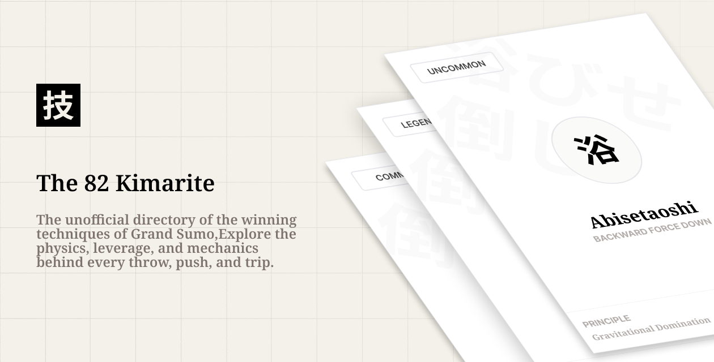

# WAZA · The Sumo Mechanics Index



A React + Vite playground for exploring all 82 sumo kimarite with live physics sketches, a referee quiz mode, and an admin editor that writes directly to Firebase.

## Quickstart

```bash
cp .env.local.example .env.local   # or create manually with Firebase creds
npm install
npm run dev
```

- `npm run export:techniques` – dumps the static `TECHNIQUES` array to `scripts/techniques.json`.
- `npm run seed` – pushes that JSON into Firestore (requires `scripts/serviceAccountKey.json`).
- `npm run test` – Playwright smoke suite (deck, detail, admin, referee routes).

## Firebase Notes

1. Create a Firebase Web App and copy the config into `.env.local`:
   ```
   VITE_FIREBASE_API_KEY=...
   VITE_FIREBASE_AUTH_DOMAIN=...
   ```
2. Add at least one admin user, then create the Firestore document `admins/{uid}` so the Dojo Editor unlocks.
3. Deploy the included `firestore.rules` for public-read / admin-write protection.

That’s it—run `npm run dev`, browse `#/` for the deck, `#/referee` for Gyōji Mode, and `#/admin` for the keyframe editor.
